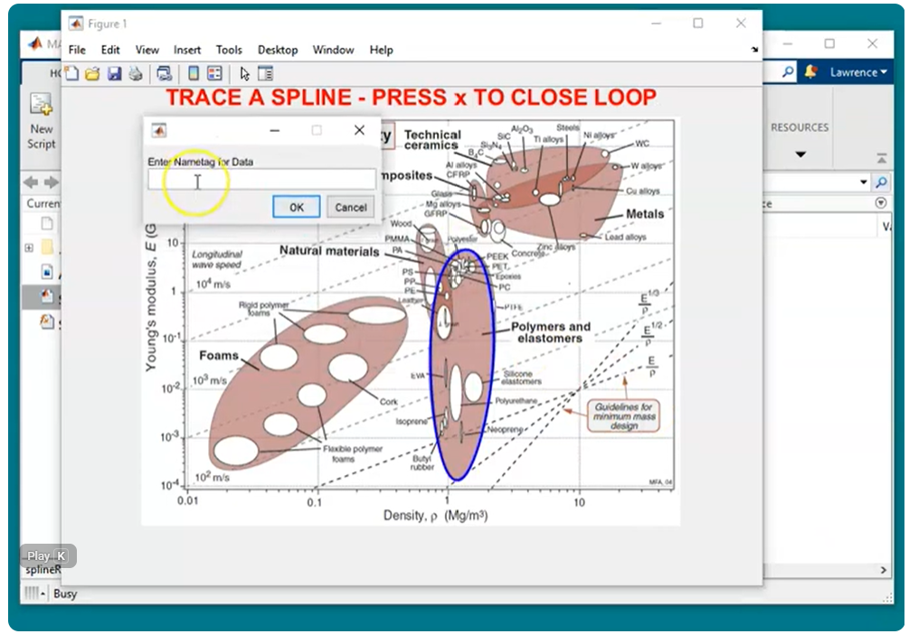

Tool for extracting closed regions from images of plots in MATLAB.

Import any image file, define a scale that relates the image size to the axes limits (including logrithmic scaling), then grab as many closed regions as you like. 

Includes a functions for plotting the spline region datasets in a Matlab Figure for combining with other datasets.

[Demo video](https://www.youtube.com/watch?v=LFeAK5P497M); code is also hosted on the [Mathworks File Exchange](https://de.mathworks.com/matlabcentral/fileexchange/132508-splineregionextractor).

